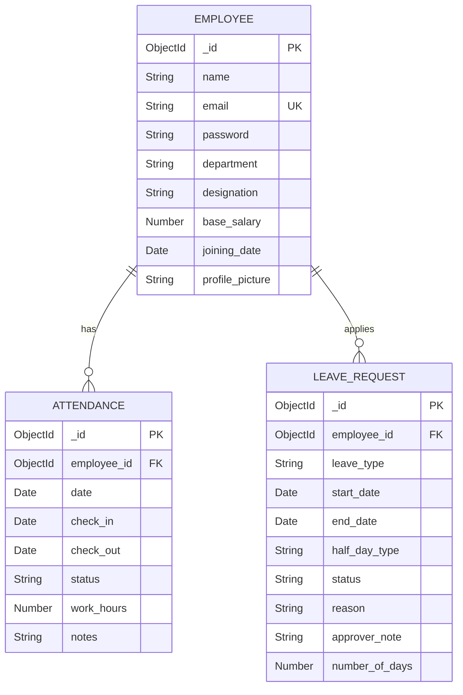

# 🏢 Intelligent Attendance & Leave Management System

A full-stack corporate HR platform that tracks daily attendance, manages leave applications and approvals, calculates salary deductions, and generates visual reports — replacing error-prone Excel-based workflows.

## 📋 Problem Statement

Corporate HR teams rely on Excel uploads and manual approvals for attendance and leave tracking, causing conflicting records, incorrect salary deductions, and audit issues. This application solves these problems with a web-based system featuring:

1. **Daily attendance tracking** via check-in/check-out buttons
2. **Leave application & approval workflow** with balance management
3. **Automated salary deduction calculations**
4. **Visual reports and dashboards** with Chart.js

---

## 🛠️ Tech Stack

| Layer | Technology |
|-------|-----------|
| **Frontend** | HTML5, CSS3, Vanilla JavaScript |
| **Backend** | Node.js, Express.js |
| **Database** | MongoDB Atlas |
| **Authentication** | JWT (JSON Web Tokens) |
| **Charts** | Chart.js |
| **File Upload** | Multer |
| **API Testing** | Postman |

---

## 📐 Architecture

```
┌─────────────────────────────────────────────────┐
│                   FRONTEND                       │
│  HTML/CSS/JS (login, dashboard, attendance,      │
│  leave, reports, employees, profile pages)        │
└──────────────────────┬──────────────────────────┘
                       │ REST API (fetch)
┌──────────────────────▼──────────────────────────┐
│                   BACKEND                        │
│  Express.js + JWT Auth (admin/employee roles)    │
│  Routes → Controllers → Models                   │
└──────────────────────┬──────────────────────────┘
                       │ Mongoose ODM
┌──────────────────────▼──────────────────────────┐
│                  DATABASE                        │
│  MongoDB Atlas (employees, attendance,           │
│  leave_requests collections)                     │
└─────────────────────────────────────────────────┘
```

---

## 📊 ER Diagram



---

## 🔌 API Endpoints

### Authentication
| Method | Endpoint | Description |
|--------|----------|-------------|
| POST | `/api/auth/login` | Unified login (admin/employee) |
| POST | `/api/employee/register` | Employee registration |

### Employees
| Method | Endpoint | Description |
|--------|----------|-------------|
| GET | `/api/employees/allemployee` | List all employees |
| GET | `/api/employees/me/profile` | Get logged-in employee profile |
| PUT | `/api/employees/me/profile` | Update profile (name/email) |
| PUT | `/api/employees/me/profile/picture` | Upload profile picture |
| GET | `/api/employees/admin/dashboard` | Admin dashboard data |
| GET | `/api/employees/me/dashboard` | Employee dashboard data |

### Attendance
| Method | Endpoint | Description |
|--------|----------|-------------|
| POST | `/api/attendance/checkin` | Employee check-in |
| PUT | `/api/attendance/checkout` | Employee check-out |
| GET | `/api/attendance/history` | Employee attendance history |
| GET | `/api/attendance/daily?date=` | Daily attendance (admin) |
| GET | `/api/attendance/all` | All attendance records (admin) |

### Leave Management
| Method | Endpoint | Description |
|--------|----------|-------------|
| POST | `/api/leaves/apply` | Apply for leave |
| PUT | `/api/leaves/:id/approve` | Approve leave request |
| PUT | `/api/leaves/:id/reject` | Reject leave request |
| GET | `/api/leaves/balance` | Get leave balance |
| GET | `/api/leaves/my` | Get employee's leaves |
| GET | `/api/leaves` | Get all leaves (admin) |
| GET | `/api/leaves/pending` | Get pending leaves (admin) |

### Reports
| Method | Endpoint | Description |
|--------|----------|-------------|
| GET | `/api/reports/salary?month=&year=` | Monthly salary report |
| GET | `/api/reports/leave-utilization?year=` | Leave utilization report |
| GET | `/api/reports/attendance-summary?month=&year=` | Attendance summary |
| GET | `/api/reports/department-averages?month=&year=` | Department averages |

---

## 📋 Business Rules

- **Departments**: IT (₹80K), HR (₹60K), Finance (₹75K), Marketing (₹65K), Operations (₹55K)
- **Leave Limits**: Casual: 12/year, Sick: 10/year, Earned: 15/year, Unpaid: Unlimited
- **Half-day**: Counts as 0.5 day (work < 4 hours auto-detected)
- **Overlap Prevention**: Cannot apply leave for overlapping dates
- **Auto Attendance**: Approved leave auto-creates attendance records as "On Leave"
- **Salary Deductions**: Absent without leave = 1 day deducted; Half-day = 0.5 day; Unpaid leave = 1 day; Approved paid leave = No deduction
- **Office Hours**: Check-in after 10:30 AM = "Late" status

---

## 🚀 Setup Instructions

### Prerequisites
- Node.js (v18+)
- MongoDB Atlas account (or local MongoDB)
- npm

### Steps

1. **Clone the repository**
   ```bash
   git clone <repo-url>
   cd AMS
   ```

2. **Install dependencies**
   ```bash
   npm install
   ```

3. **Configure environment variables**
   Create `backend/.env`:
   ```env
   MONGODB_URL=mongodb+srv://<username>:<password>@<cluster>.mongodb.net/<dbname>
   JWT_SECRET=your_jwt_secret_key
   ADMIN_EMAIL=admin@example.com
   ADMIN_PASSWORD=admin123
   ```

4. **Start the server**
   ```bash
   node backend/main.js
   ```

5. **Open in browser**
   - Frontend: http://localhost:8080/login.html
   - API Docs: Test via Postman at http://localhost:8080/api

---

## 📁 Project Structure

```
AMS/
├── backend/
│   ├── main.js                          # Express app entry point
│   ├── config/db.js                     # MongoDB connection
│   ├── middleware/
│   │   ├── authAdmin.js                 # Admin JWT middleware
│   │   ├── authEmployee.js              # Employee JWT middleware
│   │   └── uploadImage.js               # Multer file upload
│   ├── models/
│   │   ├── Employee.js                  # Employee schema + salary rules
│   │   ├── Attendance.js                # Attendance schema
│   │   └── LeaveRequest.js              # Leave schema + leave rules
│   ├── routes/
│   │   ├── Employees.js                 # Employee + dashboard routes
│   │   ├── attendanceRoutes.js          # Attendance CRUD routes
│   │   ├── leaveRoutes.js               # Leave management routes
│   │   ├── reportRoutes.js              # Report generation routes
│   │   ├── authRoutes.js                # Login route
│   │   └── employeeAuthRoutes.js        # Registration route
│   ├── services/
│   │   ├── Employee_service.js          # Employee CRUD + profile
│   │   ├── attendanceController.js      # Check-in/out + history
│   │   ├── leaveController.js           # Apply/approve/reject + balance
│   │   ├── salaryController.js          # Salary calculation engine
│   │   ├── reportController.js          # Report generation
│   │   └── adminController.js           # Admin dashboard
│   └── user/
│       └── authController.js            # Unified login controller
├── Attendance/                          # Frontend
│   ├── login.html                       # Login + Registration
│   ├── dashboard.html                   # Dashboard with charts
│   ├── attendance.html                  # Check-in/out + history
│   ├── leave.html                       # Leave apply + admin management
│   ├── reports.html                     # Salary & attendance reports
│   ├── Employees.html                   # Employee directory
│   ├── profile.html                     # Employee profile
│   ├── api.js                           # API endpoint configuration
│   ├── js/
│   │   ├── app.js                       # Shared utilities & helpers
│   │   └── login.js                     # Login/register logic
│   └── css/
│       └── style.css                    # Application styles
├── tests/
│   └── api.test.js                      # API integration tests
└── README.md
```

---

## 👥 Team

| Member | Role |
|--------|------|
| [Name 1] | Frontend Development |
| [Name 2] | Backend API Development |
| [Name 3] | Database & Business Logic |
| [Name 4] | Integration & Testing |

---

## 🔮 Future Improvements

- Email notifications on leave approval/rejection
- Biometric/GPS-based attendance
- Role-based access with multiple admin levels
- Export reports to PDF
- Mobile responsive PWA
- Payslip generation
